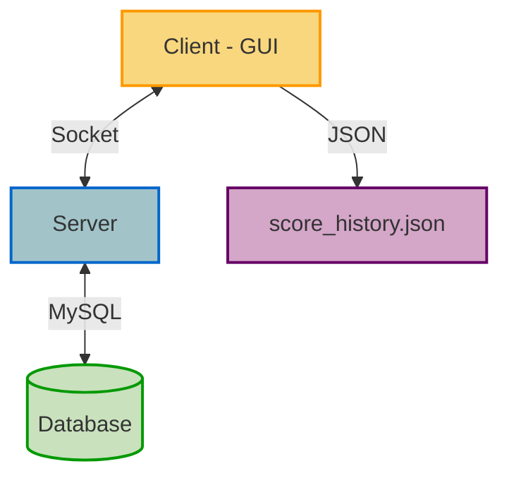
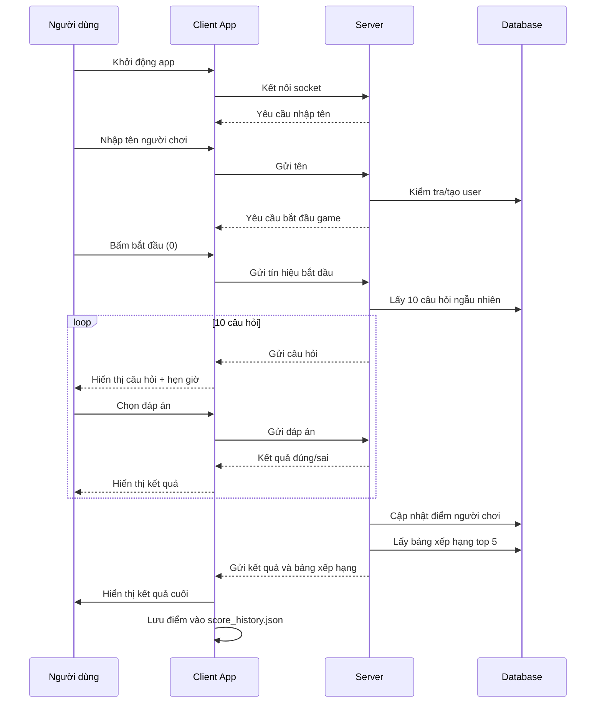
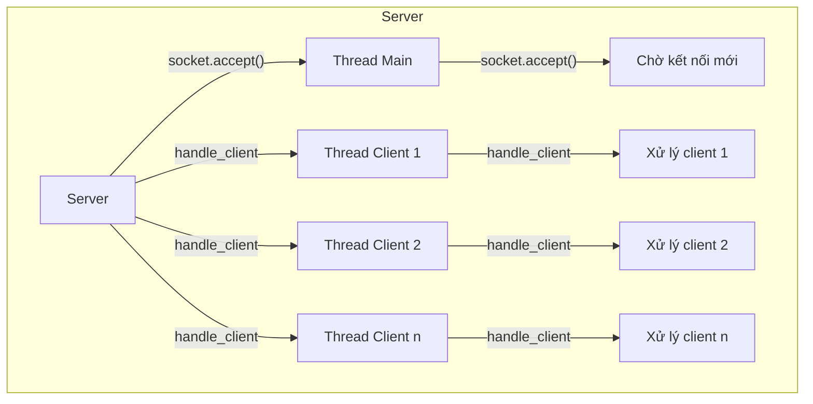
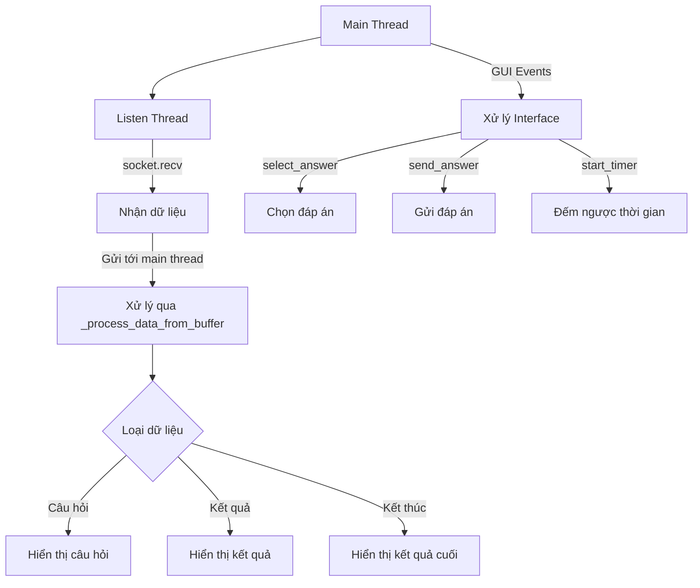
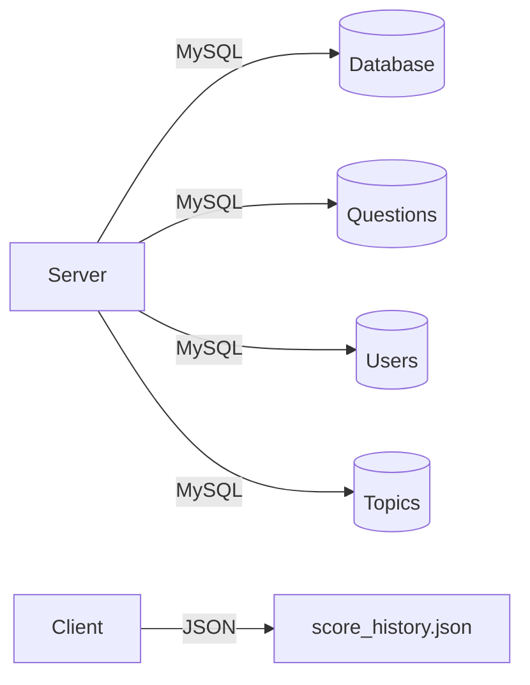

# Kiến Trúc Hệ Thống

## Tổng quan

Hệ thống Trắc Nghiệm Online được thiết kế theo mô hình client-server, sử dụng kết nối socket TCP/IP để giao tiếp giữa client và server.



## Luồng dữ liệu



## Giao tiếp Client-Server

Giao thức giao tiếp giữa client và server là các tin nhắn văn bản qua giao thức TCP, với các định dạng cụ thể:

1. **Bắt đầu kết nối**:

   - Server -> Client: "Chào mừng đến với trò chơi trắc nghiệm!\nXin mời nhập tên của bạn:\n"
   - Client -> Server: "[Tên người chơi]"
   - Server -> Client: "Xin chào [Tên]! Để bắt đầu trò chơi, nhấn phím 0 và Enter:\n"
   - Client -> Server: "0"

2. **Gửi câu hỏi**:

   - Server -> Client:
     ```
     Câu {số thứ tự}:
     Chủ đề: {tên chủ đề}
     {nội dung câu hỏi}
     A. {đáp án A}
     B. {đáp án B}
     C. {đáp án C}
     D. {đáp án D}
     Nhập đáp án (A/B/C/D):
     ```

3. **Nhận đáp án và gửi kết quả**:

   - Client -> Server: "[A/B/C/D]"
   - Server -> Client (đáp án đúng): "Đáp án đúng!\n\n"
   - Server -> Client (đáp án sai): "Đáp án sai! Đáp án đúng là: {đáp án đúng}\n\n"

4. **Kết thúc trò chơi**:

   - Server -> Client:

     ```
     Trò chơi kết thúc! Điểm của bạn: {điểm}/10

     === BẢNG XẾP HẠNG TOP 5 ===
     1. {tên} - {điểm} điểm
     2. {tên} - {điểm} điểm
     ...

     Cảm ơn bạn đã chơi!
     ```

## Xử lý đồng thời



Phía server sử dụng xử lý đa luồng để hỗ trợ nhiều người chơi cùng lúc. Mỗi kết nối client được xử lý bởi một luồng riêng biệt.

## Luồng dữ liệu phía Client



Phía client sử dụng hai luồng:

1. **Main Thread**: Xử lý giao diện người dùng và sự kiện
2. **Listen Thread**: Chuyên lắng nghe dữ liệu từ server và gửi tới main thread để xử lý

## Lưu trữ dữ liệu



Hệ thống sử dụng hai cơ chế lưu trữ:

1. **MySQL**: Lưu trữ câu hỏi, thông tin người dùng và điểm số phía server
2. **JSON**: Lưu trữ lịch sử điểm số cục bộ phía client
