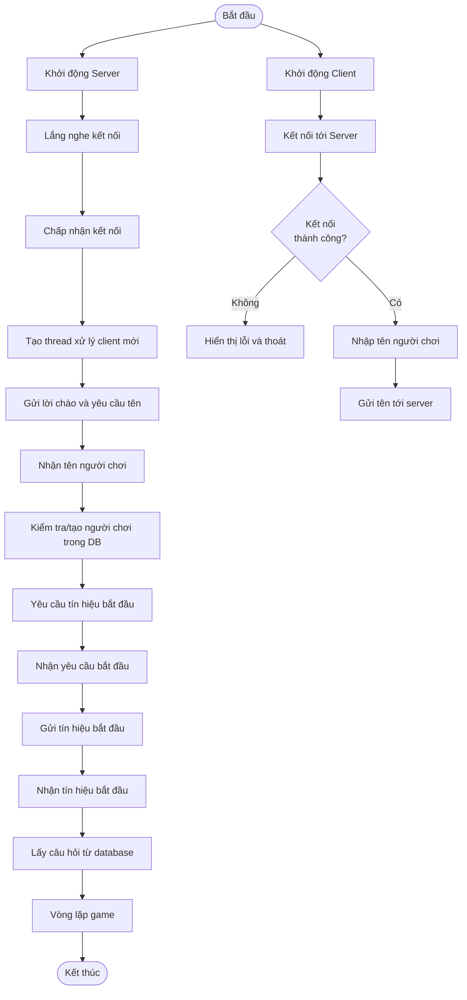
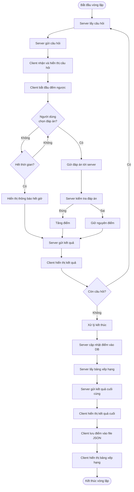
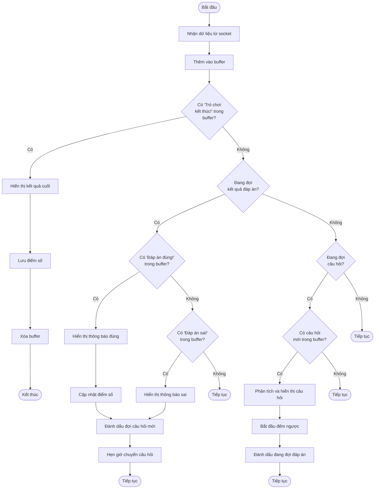
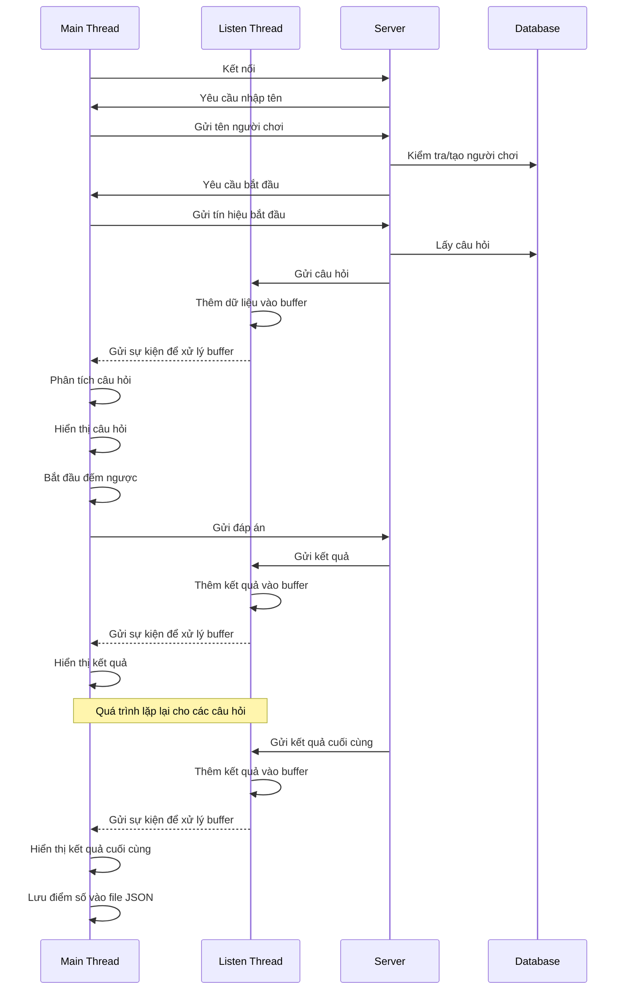
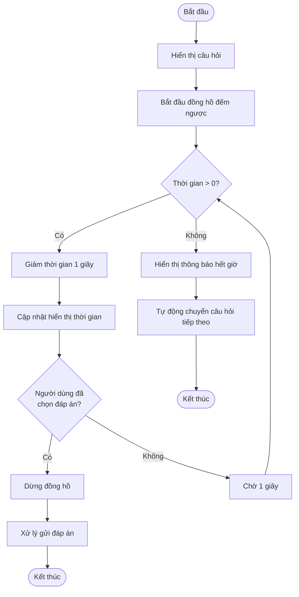
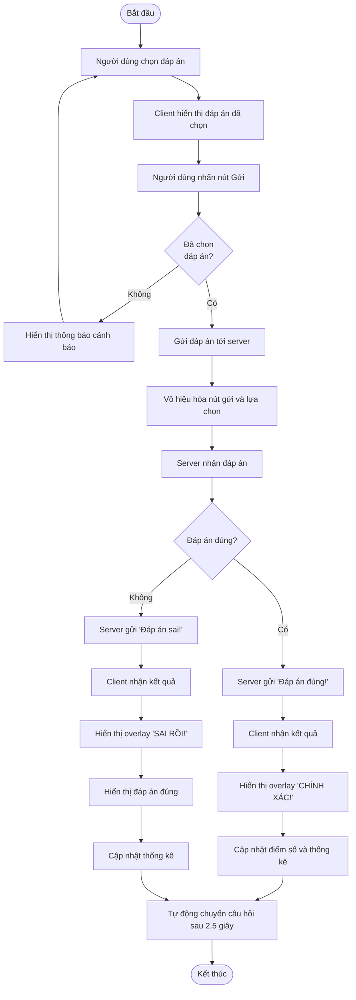

# Biểu Đồ Luồng (Flow Chart)

Các biểu đồ dưới đây mô tả luồng hoạt động của các thành phần chính trong hệ thống Trắc Nghiệm Online.

## 1. Luồng hoạt động tổng quát của hệ thống

## 2. Vòng lặp trò chơi (Game Loop)

## 3. Xử lý dữ liệu của Client

## 4. Đồng bộ hóa giữa các Thread

## 5. Luồng xử lý timeout

## 6. Quá trình xử lý đáp án

