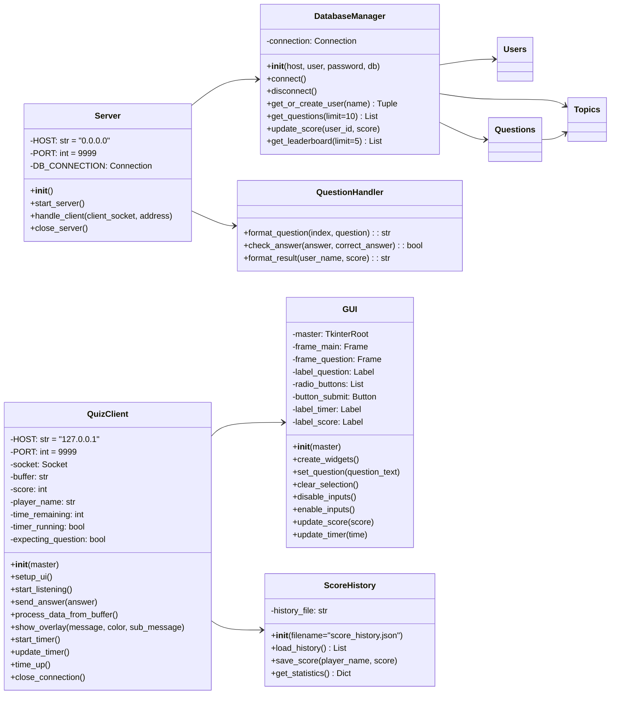
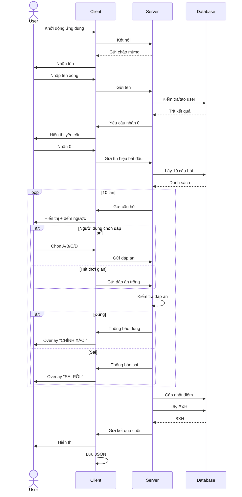
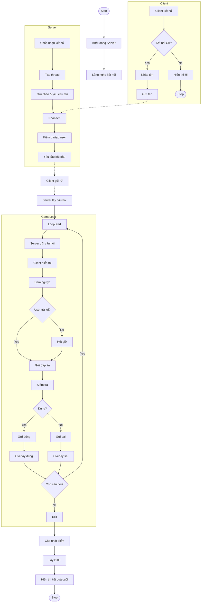
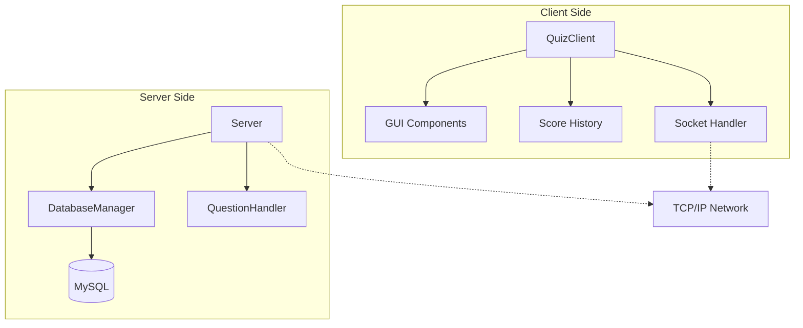
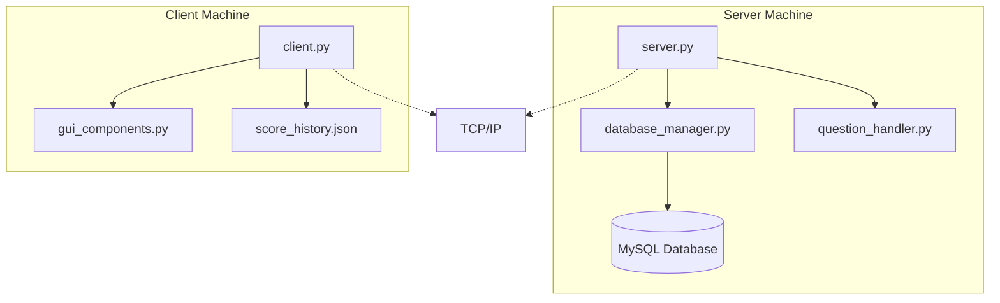
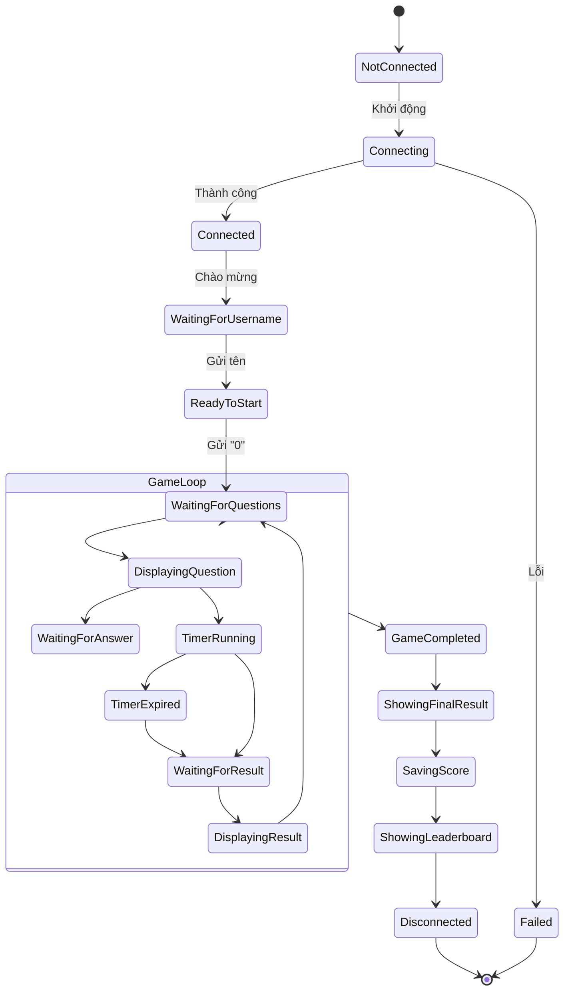
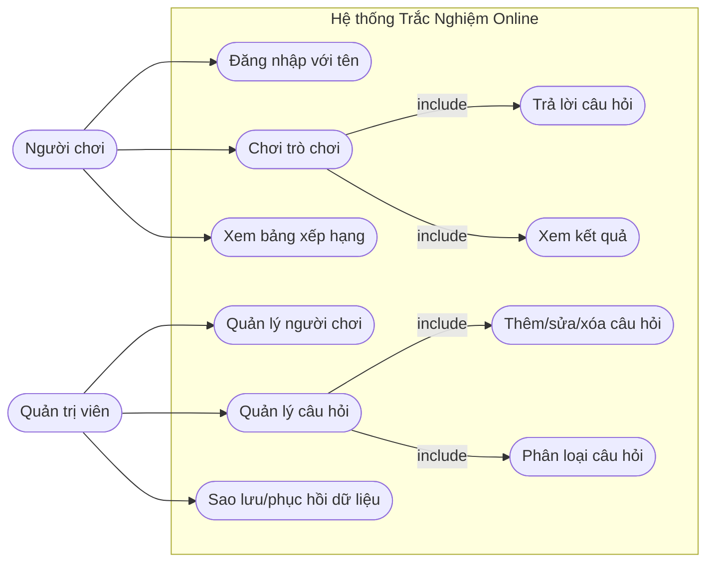
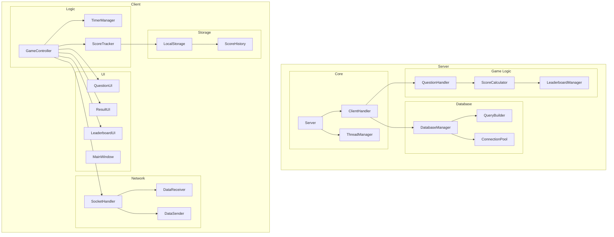

# Biểu Đồ UML (Mermaid Version)

Bộ sơ đồ dưới đây mô tả hệ thống Trắc Nghiệm Online bằng cú pháp **Mermaid** (thay thế hoàn toàn cho PlantUML cũ). Bạn có thể copy-paste trực tiếp vào bất kỳ công cụ nào hỗ trợ Mermaid để xem.

---

## 1. Class Diagram

---

## 2. Sequence Diagram

---

## 3. Activity Diagram

---

## 4. Component Diagram

---

## 5. Deployment Diagram

---

## 6. State Diagram

---

## 7. Use-Case Diagram

---

## 8. Package Diagram

