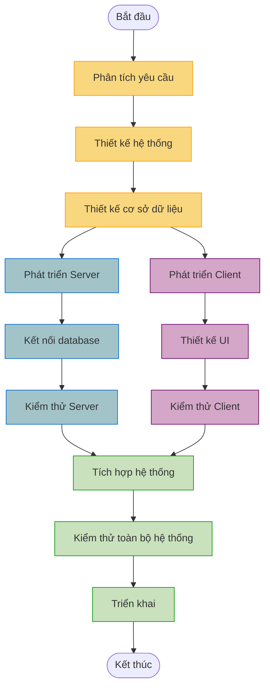
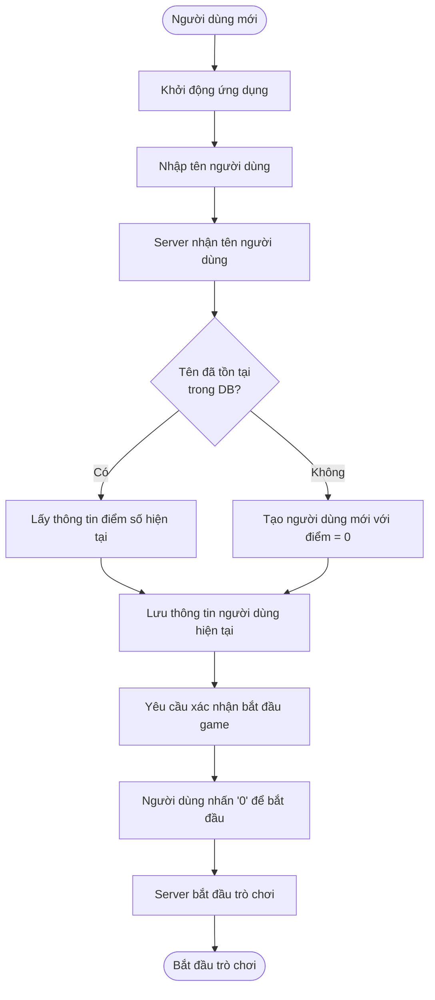
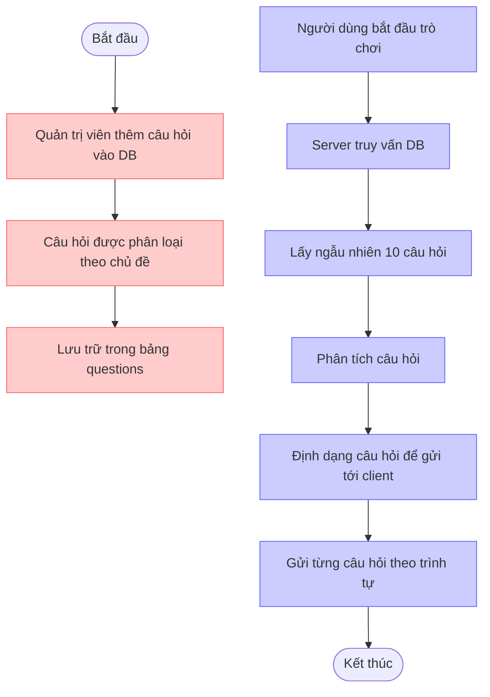
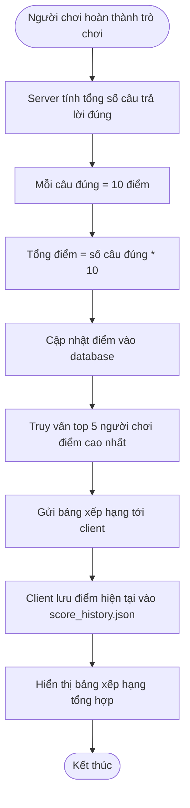
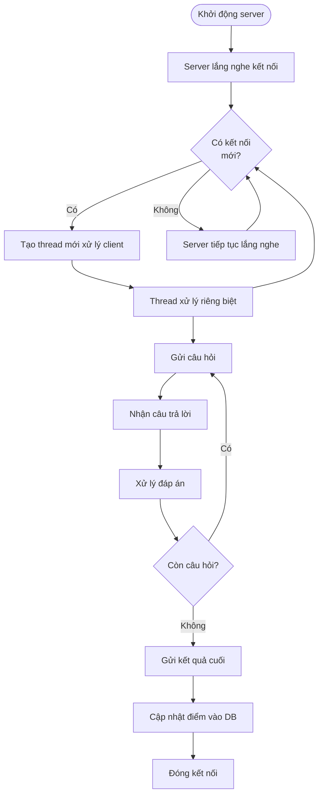
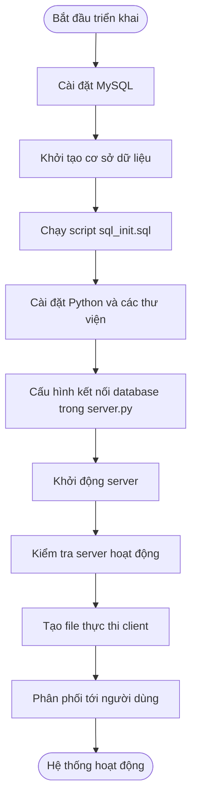
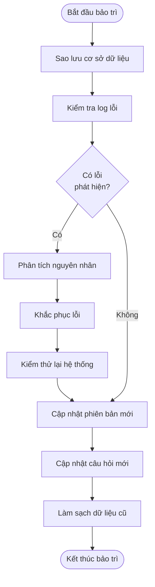
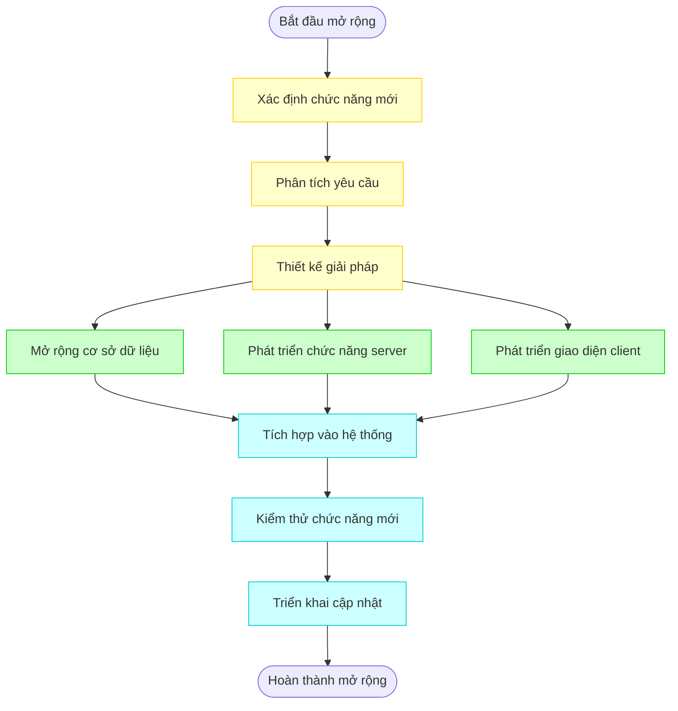

# Biểu Đồ Quy Trình (Workflow Chart)

Các biểu đồ dưới đây mô tả các quy trình hoạt động chính của hệ thống Trắc Nghiệm Online.

## 1. Quy trình phát triển hệ thống

## 2. Quy trình đăng ký và xác thực người dùng

## 3. Quy trình lưu trữ và truy xuất câu hỏi

## 4. Quy trình tính điểm và cập nhật bảng xếp hạng

## 5. Quy trình xử lý đồng thời nhiều người dùng

## 6. Quy trình triển khai hệ thống

## 7. Quy trình bảo trì hệ thống

## 8. Quy trình mở rộng chức năng

